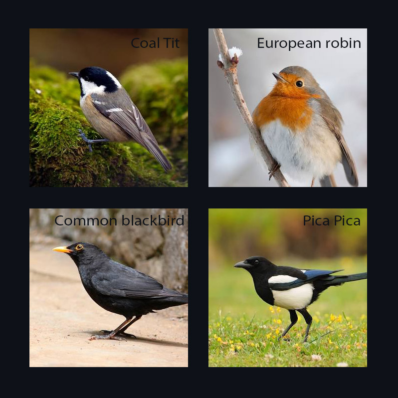
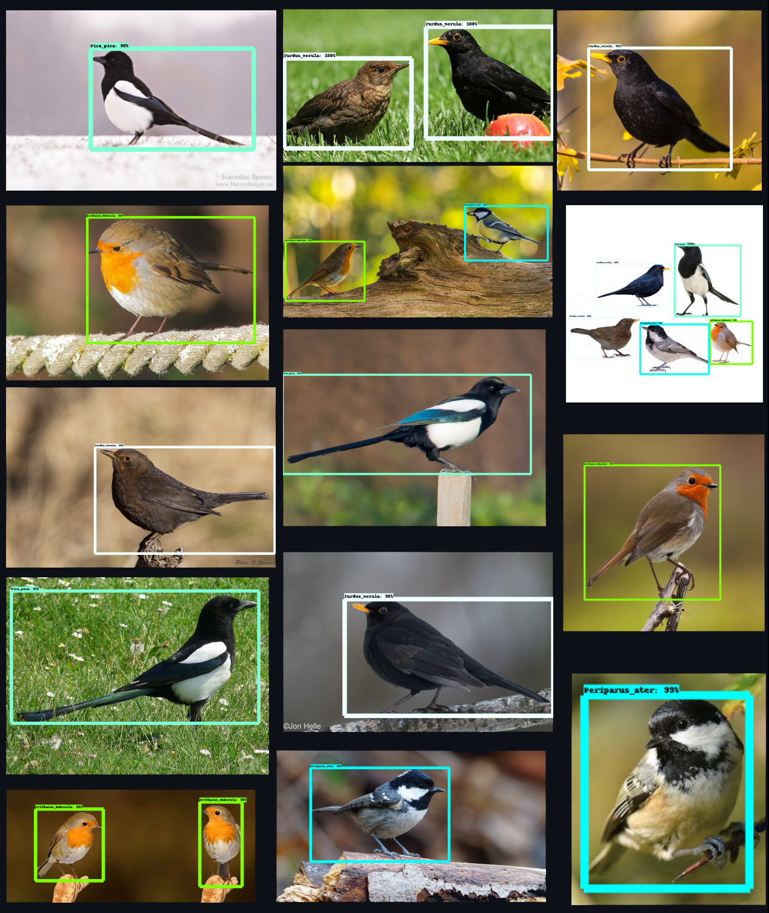

# Object Detection Model for Bird Species Identification

This repository contains code for training two custom object detection models that can identify four different species of birds commonly found in the UK: Eurasian magpie (Pica pica), Erithacus rubecula (European robin), Turdus merula (Common blackbird), and Periparus ater (Coal tit).

The models are based on two different algorithms: ResNet101 Faster R-CNN and ResNet101 SSD. The repository includes five Jupyter notebooks that divide the code for preprocessing the data, training the models, and evaluating their performance.

Please note that the dataset is not included in the repository. However, it can be provided upon request to interested researchers and developers. The training data consists of annotated images of the four bird species. The images in the dataset are collected by CSM department of Liverpool Jhon Moores University. The annotations are in the COCO format and include bounding boxes around the birds.

Each Jupyter notebook corresponds to a specific stage of the object detection pipeline, including data preparation, model training, evaluation, and inference. The ResNet101 Faster R-CNN and ResNet101 SSD models are suitable for real-time object detection, and researchers can choose the model that suits their application based on the required balance between speed and accuracy.
## Setup

In order to utilize the jupyter notebooks and code files in this repository, it is necessary to have TensorFlow object detection API installed. To install it, please refer to the official documentation provided in the following link:

[Official Documentation for TensorFlow Object Detection API Installation](https://tensorflow-object-detection-api-tutorial.readthedocs.io/en/latest/install.html)

Once the installation process is complete, you can proceed with using this repository to execute the code.

The trained models can be used for a variety of applications, such as wildlife monitoring and conservation efforts.
## Installation

To install and use the code in this repository, clone this repository: 

    git clone https://github.com/AbdullahTabassam/Custom-Object-Detection

## Jupyter notebooks

- **Pre-processing**: The notebook named `Pre-processing.ipynb` includes the preprocessing steps undertaken before training the models. These steps also involve data augumentation. For more on image data augumentation visit: [ImgAug](https://github.com/aleju/imgaug)

- **Training**: The notebook named `Training.ipynb` encompasses the processes of creating TF records, configuring hyperparameters, training the models, and exporting the trained inference graph.

- **Evaluation**: The notebook named `Evaluation.ipynb` presents the evaluation results of the models and corresponding tensorboard plots.

- **Tensorboard**: The notebook named `Tensorboard.ipynb` provides instructions for running Tensorboard and displays plots depicting the training losses of both models.

- **Inference**: The notebook named `Inference.ipynb` showcases the results of performing inference using the models. It also includes steps to execute inference and provides images of selected inference results.

## Detections
A few of the detections are shown below:

